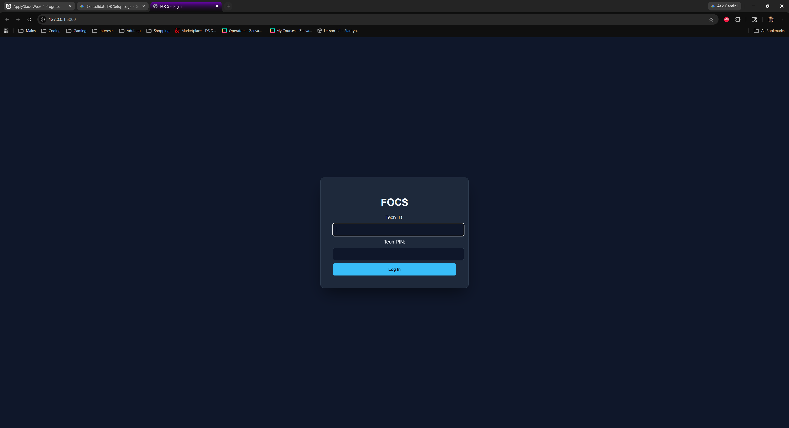
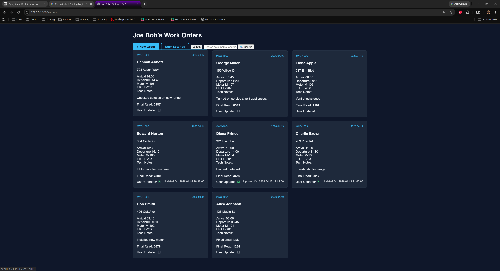
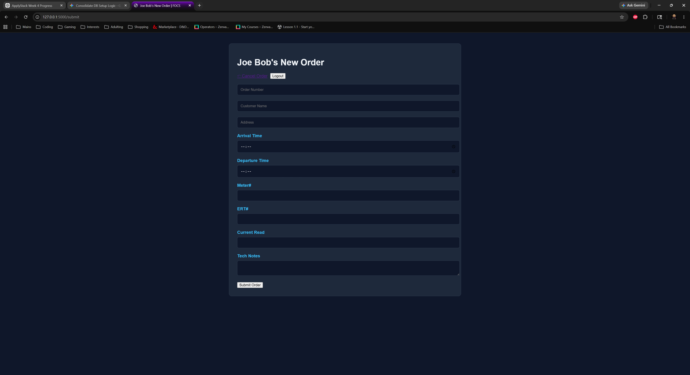
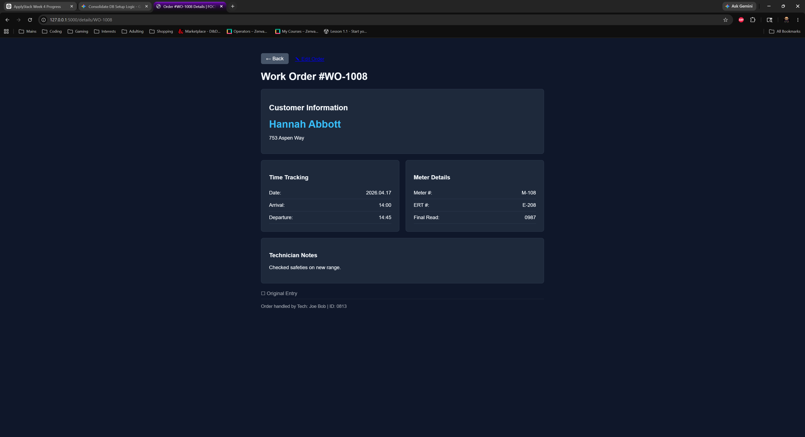
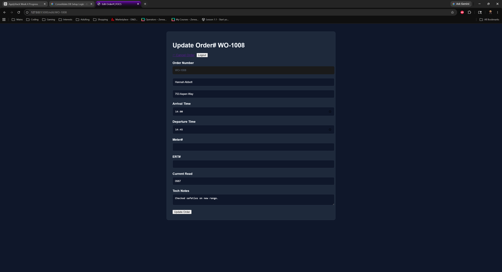
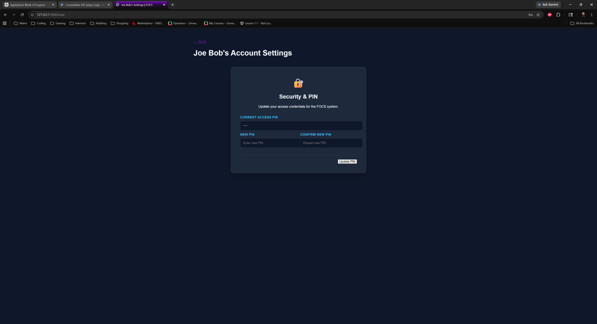
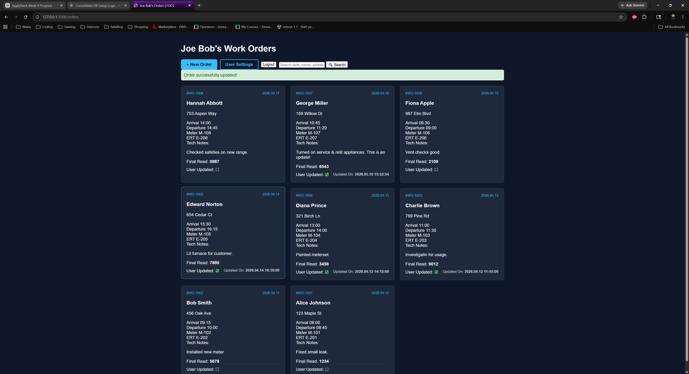
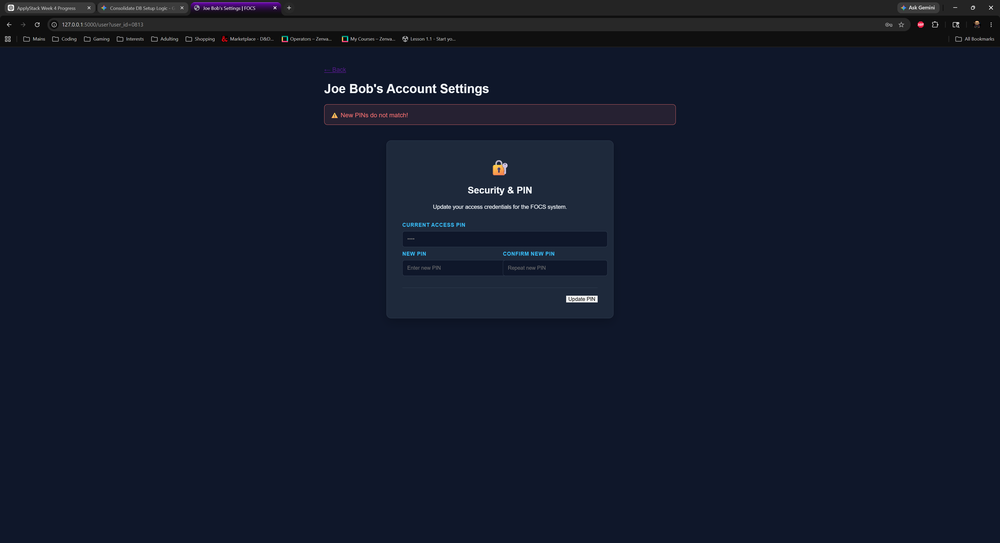

# FOCS - Field Order Completion System

FOCS is a Flask and SQLite web application for tracking completed field work orders by technician.

It began as a CLI project and was later rebuilt into a browser-based internal tool to practice web development, authentication, session handling, database migrations, and CRUD workflows in a more realistic app structure.

## Why I Built This

I built FOCS to create a practical tool based on a field workflow I already understand.

Instead of building a generic demo app, I wanted to design something that reflected real technician record-keeping while helping me practice:

- Flask routing and templates
- SQLite database design
- authentication and session-based access
- create, read, update flows
- form validation and user feedback
- refactoring a CLI project into a web application

## Features

- Technician login with ID and PIN
- PIN hashing with Werkzeug plus app-level peppering
- Session-based authentication
- Rate-limited login attempts with Flask-Limiter
- First-run database setup with seeded demo users
- Migration support for newer database fields
- Orders dashboard with:
  - all orders for the logged-in technician
  - search by date, customer name, address, meter number, or ERT number
  - success and error flash messages
- Create new work orders
- View full work order details
- Edit existing work orders
- Track whether an order has been updated
- Store update timestamps for edited orders
- User settings page to change PIN

## Tech Stack

- Python 3
- Flask
- SQLite3
- Jinja2
- Flask-Limiter
- python-dotenv
- Werkzeug security helpers
- HTML / CSS

## Project Structure

```text
FOCS-Field-Order-Completion-System-/
├── app.py
├── db.py
├── README.md
├── .gitignore
├── data/
│   ├── FOCS.db
│   ├── seed_orders.csv
│   └── screenshots/
├── templates/
│   ├── login.html
│   ├── orders.html
│   ├── submit_order.html
│   ├── details.html
│   ├── edits.html
│   └── settings.html
└── static/
    └── css/
```

## Screenshots

### Login Page


### Orders Dashboard


### New Order Form


### Work Order Details


### Edit Order


### Settings Page


### Success Message


### Error Message


## Setup

### 1. Install Python
Use Python 3.11 or newer.

### 2. Clone the repository
```bash
git clone <your-repo-url>
cd FOCS-Field-Order-Completion-System-
```

### 3. Create and activate a virtual environment
```bash
python -m venv venv
```

Windows:
```bash
venv\Scripts\activate
```

Mac/Linux:
```bash
source venv/bin/activate
```

### 4. Install dependencies
```bash
pip install -r requirements.txt
```

### 5. Create a `.env` file
Example:

```env
SECRET_KEY=replace_me
PEPPER=replace_me
```

### 6. Run the app
```bash
python app.py
```

Then open your browser to:

```text
http://127.0.0.1:5000
```

## First Run Behavior

On first launch, FOCS will:

- create the SQLite database
- create required tables
- apply database migrations for newer fields if needed
- seed demo users
- seed demo work orders from `data/seed_orders.csv`

## Demo Users

FOCS seeds demo users on first run:

- **Joe Bob**
  - ID: `0813`
  - PIN: `7777`

- **Randy Sanchez**
  - ID: `9999`
  - PIN: `8888`

## Example Workflow

1. Log in as a demo technician
2. View that technician’s work orders
3. Search for a specific order
4. Open a work order details page
5. Create a new work order
6. Edit an existing work order
7. Change your PIN in User Settings

## What I Learned

This project helped me practice and improve:

- converting a CLI project into a web application
- designing authenticated Flask routes
- protecting user-specific records with ownership checks
- building SQLite-backed CRUD workflows
- using Jinja templates to render dynamic pages
- handling form validation and preserving user input on errors
- adding login protection and session handling
- hashing and verifying user PINs securely
- organizing database logic into reusable helpers
- supporting first-run setup and lightweight schema migration

## Future Improvements

Some next-step improvements I may add later include:

- admin dashboard and technician management
- delete/archive workflow for work orders
- stronger PIN rules and account controls
- export/reporting features
- more detailed edit history and audit tracking
- responsive layout improvements
- cleaner UI polish across all screens

## Notes

FOCS is intentionally scoped as a small internal-tool style project.

The goal was not to build a full enterprise field management platform, but to create a practical portfolio project that demonstrates:

- Flask application structure
- SQLite-backed data workflows
- authentication and ownership checks
- clean create/read/update flows
- migration-aware project growth
